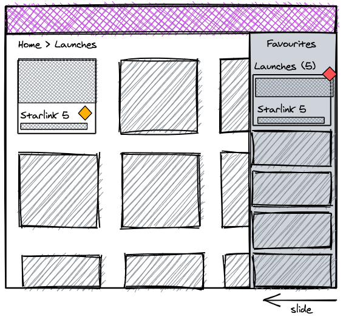

# The Pleo Frontend Challenge

Here at Pleo we love space. For example, we name all our microservices after
moons of the solar system. But before you get to the moons, you have to go
through rockets. Welcome to our frontend challenge!

We've built a simple web app that displays information about rocket launches,
fetched from the unofficial SpaceX API V3 at
[spacexdata.com](https://docs.spacexdata.com/?version=latest). We want you to
make a few changes to the app.

## Tasks

### 1. Fix a bug

The team discovered that the launch datetime on the launch details page (e.g.
`/launches/92`) is displayed in the timezone of the app's user. However, the
intent was to show it in the local timezone of the launch site instead (still
displaying the timezone name or offset). After a discussion the team decided to
make the change, but keep the time in the user's timezone as a tooltip when
hovering the timestamp. You pick up that ticket.

#### Guidelines for Task 1

- treat this as if you fixed a bug in an app you work on together with a team,
  and the app is in production

### 2. Build a feature

We would like you to add a "favorites" feature to the app. The requirements are:

- a user can mark - "star" - launches or launch pads as favorites - both from
  the list and details page for all items
- a list of favorites is available as a slide-in drawer (see the sketch below)
- from the list, the user can navigate to the favorite items
- the user is able to remove items from the list (from within the list and on
  the details page of an item that is currently in the list)
- the list is persisted after the app is closed (but everything is stored
  locally for now)

Here is a sketch of the feature:

#### Guidelines for Task 2

- treat this as if you implemented a new feature in an app you work on together
  with a team, and the app is in production
- this app is not finished, there will be more pages added in the future, and
  the feature you're implementing might be extended - consider that when
  building your solution
- most UI components should be available in Chakra UI
- when in doubt about the design or functionality, make a decision yourself
- we estimate that this task can be done within a few hours - you can use the
  PR description to list and discuss the things you decided to de-scope, potential
  next steps etc.

### 3. Impress us

This last task is a chance for you to impress us. What you do is really up to
you - show us your best skills, be creative and try not to spend more than a few
hours. You can add a new feature (e.g. filtering of lists), or a whole new
section to the app (explore the API, there is a ton we haven't used yet), add a
comprehensive test suite, improve the tooling or app's architecture, add
beautiful animations etc.

#### Guidelines for Task 3

- treat this last task as a little hackathon - no need for tests and covering
  all edge cases - although the code quality still matters
- whatever you choose to do, choose the scope so that you can finish and make
  sure to leave the app in a "deployable" state
- scope the work so you can finish within a few hours - you can use the PR
  description to list and discuss the things you decided to de-scope, potential
  next steps etc.

## Practicalities

When you're ready to work on the challenge, clone (and not fork) the repo and
implement each task as a separate pull request against your version of the repo.
Prepare the PRs as if you would when contributing to a project you develop with
a team. Merge each PR when you're done with a task.

When you're ready to submit your challenge, share the link to your repo with us.
If you prefer to keep it private, we will provide you with some emails to invite
to the repo. It would be great if you made the app with your improvements
available online (e.g. using Netlify or a similar service).

We're excited to have you take on this challenge and looking forward to seeing
your solution. Happy coding!
